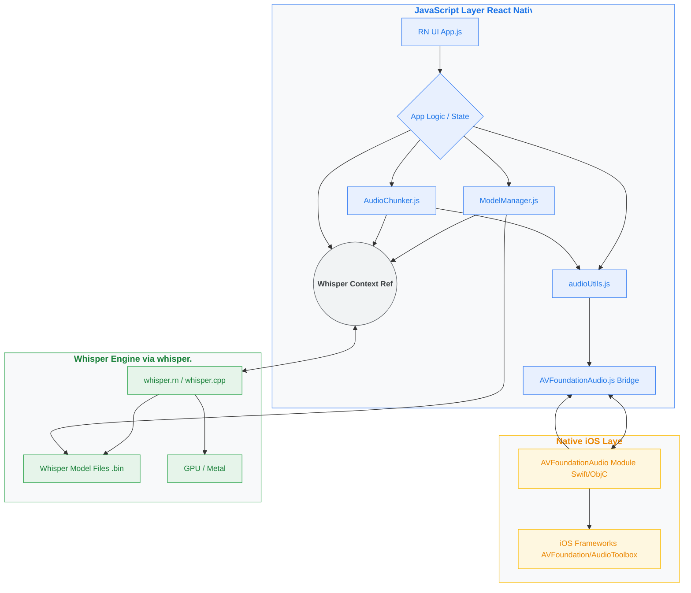

# native-whisper-transcription: System Architecture and Implementation Details

**Author:** Gabriel Anyosa
**Date:** April 3, 2025
**Status:** Implemented (with known issues)
**Document Version:** 1.1

*Initial Design Document Version: 1.0 (April 1, 2025)*

**Related:** [README.md](../README.md)

## Table of Contents

1.  [Overview](#1-overview)
2.  [Background & Motivation](#2-background--motivation)
3.  [Goals](#3-goals)
4.  [Non-Goals](#4-non-goals)
5.  [System Architecture](#5-system-architecture)
    * [5.1 Performance Profiles](#51-performance-profiles)
    * [5.2 Chunking Implementation (`AudioChunker.js`)](#52-chunking-implementation-audiochunkerjs)
    * [5.3 GPU Acceleration](#53-gpu-acceleration)
    * [5.4 Model Selection & Management (`ModelManager.js`)](#54-model-selection--management-modelmanagerjs)
    * [5.5 Native iOS Audio Processing (`AVFoundationAudio` Module)](#55-native-ios-audio-processing-avfoundationaudio-module)
    * [5.6 JavaScript Utilities (`audioUtils.js`)](#56-javascript-utilities-audioutilsjs)
6.  [Known Issues & Workarounds](#6-known-issues--workarounds)
    * [6.1 CRITICAL: Crash on Releasing Used Model Context](#61-critical-crash-on-releasing-used-model-context)
    * [6.2 Expo AV Recording Duration Unreliable](#62-expo-av-recording-duration-unreliable)
    * [6.3 Metro Bundler Model `require` Warning](#63-metro-bundler-model-require-warning)
7.  [Key Implementation Details](#7-key-implementation-details)
    * [7.1 Error Handling](#71-error-handling)
    * [7.2 Native Audio Extraction](#72-native-audio-extraction)
    * [7.3 Native Audio Duration](#73-native-audio-duration)
    * [7.4 Progress Tracking](#74-progress-tracking)
    * [7.5 Native-to-JS Logging](#75-native-to-js-logging)
8.  [Performance Considerations](#8-performance-considerations)
9.  [Testing Strategy](#9-testing-strategy)
10. [Future Extensions](#10-future-extensions)
11. [Deployment and Distribution](#11-deployment-and-distribution)
12. [Risk Assessment and Mitigation](#12-risk-assessment-and-mitigation)
13. [Success Metrics](#13-success-metrics)
14. [Appendices](#14-appendices)
    * [A. Performance Profile Parameters](#a-performance-profile-parameters)

---

## 1. Overview

This document describes the system architecture and implementation details of the MyWhisperApp iOS application as of April 2025. The application provides on-device audio transcription using OpenAI's Whisper model via the `whisper.rn` library within a React Native environment managed by Expo Development Builds.

A key component is a custom native iOS module (`AVFoundationAudio`) built with Swift and Objective-C, utilizing Apple's `AVFoundation` and `AudioToolbox` frameworks. This module handles essential audio pre-processing tasks like format conversion, duration calculation, and segment extraction, ensuring compatibility with the Whisper model and enabling efficient handling of long audio files through chunking.

---

## 2. Background & Motivation

The initial version of the application faced several challenges:

1.  **Performance:** Slow transcription speeds using default parameters.
2.  **Memory Management:** Significant memory overhead and Out-Of-Memory (OOM) crashes caused by loading the Whisper model multiple times per transcription.
3.  **Audio Format Compatibility:** Inability to reliably process standard iOS audio formats (like M4A from recordings or user selections) which are incompatible with `whisper.cpp`'s requirement for 16kHz mono WAV input. Initial attempts to use JavaScript-based or cross-platform libraries like `react-native-ffmpeg` (now unmaintained) proved insufficient or problematic.
4.  **Long Audio Handling:** Lack of a mechanism to process long audio files without exceeding memory limits or causing excessive processing times.

These limitations necessitated a significant architectural redesign focusing on native audio processing, efficient model management, GPU acceleration, and user-configurable performance trade-offs.

---

## 3. Goals

The primary objectives for this implementation were:

* Reduce transcription processing time significantly compared to the initial baseline.
* Implement tiered performance modes offering user choice between accuracy and speed.
* Implement audio chunking to reliably handle long audio files and prevent OOM issues.
* Leverage GPU acceleration available on target iOS devices (iPhone 15 Pro / A17 Pro).
* Robustly handle common iOS audio formats (WAV, M4A, MP3 etc.) by converting them to the required WAV format.
* Provide a user interface for selecting performance modes.
* Ensure the Whisper model is loaded only once and managed efficiently throughout the app lifecycle.

---

## 4. Non-Goals

* Android platform support and optimizations.
* Real-time streaming transcription features.
* Custom Whisper model training or fine-tuning.
* Server-side or cloud-based transcription processing.
* CoreML backend integration for Whisper (investigated, but `whisper.rn` focused on direct `whisper.cpp` usage).
* Support for languages beyond the capabilities of the loaded Whisper models.

---

## 5. System Architecture

The application follows a hybrid approach, combining React Native for the UI and application logic with a custom native iOS module for specialized audio tasks.



### 5.1 Performance Profiles

User-selectable performance modes are defined in `PerformanceProfiles.js`. Each profile specifies:

* `modelFile`: The target `ggml` model file (e.g., `ggml-large-v3-q5_0.bin`).
* Whisper Transcription Parameters: `bestOf`, `beamSize`, `temperature`, `maxThreads`, etc.
* Chunking Parameters: `chunkSizeMs`, `overlapMs`.
* A user-facing description.

These profiles allow users to trade off transcription speed and accuracy based on their needs. See [Appendix A](#a-performance-profile-parameters) for current definitions.

### 5.2 Chunking Implementation (`AudioChunker.js`)

For audio files exceeding the duration threshold defined by the selected performance profile's `chunkSizeMs`, the `AudioChunker` service is invoked:

1.  **Duration Check:** It first obtains the audio duration using `getAudioDuration` from `audioUtils.js` (which may involve a native call).
2.  **Chunk Calculation:** Calculates segment start/end times based on `chunkSizeMs` and `overlapMs`.
3.  **Segment Extraction:** Iteratively calls `extractAudioSegment` from `audioUtils.js` for each chunk. This utility function calls the native `AVFoundationAudio` module to perform the actual extraction (and resampling/conversion) using `AVAssetReader`/`AVAssetWriter`.
4.  **Chunk Transcription:** Transcribes each generated WAV chunk file using the main `whisperContext.transcribe` method, passing the chunk's path (derived via `uriToPath`).
5.  **Cleanup:** Deletes temporary chunk files immediately after transcription.
6.  **Result Merging:** Combines the text results from individual chunks (currently simple concatenation).

### 5.3 GPU Acceleration

GPU acceleration significantly speeds up transcription on compatible hardware (like the A17 Pro). It is enabled by default:

* `ModelManager.js` passes `useGpu: true` and `useFlashAttn: true` to `whisper.rn`'s `initWhisper` function.
* `whisper.rn` handles the interaction with `whisper.cpp`'s Metal backend.
* Logs confirm whether GPU loading was successful.

### 5.4 Model Selection & Management (`ModelManager.js`)

This class centralizes the handling of Whisper model files:

* **Model Definitions:** Knows the filenames (`ggml-large-v3-q5_0.bin`, `ggml-large-v3-turbo-q5_0.bin`), download URLs (Hugging Face), and approximate sizes.
* **Downloading:** Uses `expo-file-system` (`createDownloadResumable`) to download models on demand if they aren't present in the app's `Documents` directory. Provides progress updates and prompts the user before large downloads. Includes basic size verification post-download.
* **Loading:** Based on the selected performance mode, it determines the required `modelFile`, ensures it's available (downloading if necessary), and calls `initWhisper` from `whisper.rn` to load it into memory (using GPU). It maintains a reference (`currentModelRef`) to the loaded context.
* **Releasing:** Provides a `releaseModel` method that calls `whisperContext.release()` to free native resources associated with the currently loaded model. This is crucial for switching models. **(Note: This step currently triggers a crash - see Known Issues).**
* **State Management:** Ensures only one model is loaded at a time.

### 5.5 Native iOS Audio Processing (`AVFoundationAudio` Module)

This custom native module is essential for robust audio handling on iOS, replacing the need for less reliable or unmaintained cross-platform libraries (like FFmpeg bindings) for these core tasks.

* **Technology:** Swift (main logic), Objective-C (`.m` bridge file), `RCTBridgeModule`, `RCTEventEmitter`. Uses native iOS frameworks: `AVFoundation` and `AudioToolbox`.
* **Purpose:** Provides reliable implementations for:
    * **Format Conversion:** Converts audio files (identified by path) to 16kHz, 16-bit, mono Linear PCM WAV format using the `ExtAudioFile` C API from AudioToolbox. This handles various input codecs (AAC, MP3, etc.) supported by the OS.
    * **Duration Calculation:** Gets accurate duration (in milliseconds) using `AVAsset` properties, with a fallback to the `AudioFile` API.
    * **Segment Extraction:** Extracts specific time segments using `AVAssetReader` and `AVAssetWriter`, configured to output in the target WAV format. This efficiently combines extraction and conversion.
* **Interface:** Exposes async methods (`getAudioDuration`, `convertToWavFormat`, `extractAudioSegment`) callable from JavaScript via the bridge.
* **Path Handling:** Native methods expect standard POSIX file paths.

### 5.6 JavaScript Utilities (`audioUtils.js`)

This module acts as an abstraction layer and utility belt for audio operations in the JS environment:

* **Recording:** Wraps `expo-av` `Audio.Recording` setup, start, stop, and processing. Configures recording settings for 16kHz mono WAV output.
* **File Picking:** Wraps `expo-document-picker`, requests copy-to-cache, verifies file existence/stability using `expo-file-system`, and prompts for conversion if needed.
* **Native Module Interaction:** Calls methods on the `AVFoundationAudio.js` bridge wrapper.
* **URI/Path Conversion:** Contains helpers (`uriToPath`, `pathToUri`) and consistently converts `file://` URIs from JS APIs into POSIX paths required by the native module and `whisper.rn`'s `transcribe` function.
* **Format Checking:** Includes basic `.wav` extension checking (`isWavFile`).
* **Duration Fallback:** Implements the logic to try `expo-av` status for duration first, then fall back to the native `getAudioDuration` if needed for recordings.

---

## 6. Known Issues & Workarounds

1.  **CRITICAL: Crash on Releasing Used Model Context (`whisper.rn` Bug?)**
    * **Symptom:** The application consistently crashes when switching performance modes *after* the currently loaded model has been used for transcription. Switching between idle (loaded but unused) models works correctly.
    * **Diagnosis:** The crash occurs during the call to `whisperContext.release()` within `ModelManager.js`. Native crash logs (`.ips`) report `bug_type: 309` with `asi: {"libsystem_malloc.dylib": ["BUG IN CLIENT OF LIBMALLOC: memory corruption of free block"]}` and exception `EXC_BREAKPOINT (SIGTRAP)`. The crash is *detected* by the memory allocator during subsequent operations (often RN debugger communication) but is *caused* by memory corruption originating from the native `release()` call.
    * **Hypothesis:** The native `whisper.rn` library (or underlying `whisper.cpp`) likely fails to properly clean up all memory and/or GPU resources after a `transcribe()` operation completes. The subsequent call to `release()` then attempts to operate on invalid/corrupted/dangling pointers or resources, leading to heap corruption and the eventual crash detected by `libsystem_malloc`. This seems particularly likely when GPU acceleration (`useGpu: true`) is enabled.
    * **Workaround:** **Avoid switching performance modes within an app session after performing any transcription.** Select the desired mode initially and continue using it. Restart the app if a different mode is needed after transcription.
    * **Status:** Strongly suspected to be a bug within `whisper.rn`'s native implementation concerning resource lifecycle management post-transcription, especially with Metal. Further investigation (testing without GPU) and reporting the issue upstream (with logs and reproduction steps) are recommended.

2.  **Expo AV Recording Duration Unreliable**
    * **Symptom:** `Audio.Recording.getStatusAsync()` often returns `durationMillis: 0` after `stopAndUnloadAsync()` completes, even though the recording is successful.
    * **Workaround:** The `processRecordingForTranscription` function in `audioUtils.js` now includes a fallback mechanism. If the status check fails, it calls the custom native `getAudioDuration` method, which reliably provides the duration.

3.  **Metro Bundler Model `require` Warning**
    * **Symptom:** `WARN Could not reference model files directly via require: Requiring unknown module "undefined".` appears during bundling.
    * **Status:** Benign warning. `require` cannot bundle large `.bin` files. Models are correctly handled by `ModelManager.js` using `expo-file-system` for downloads and access. Ignore this warning.

---

## 7. Key Implementation Details

### 7.1 Error Handling

* Current strategy relies on `try...catch` blocks around major operations (model loading, audio processing, transcription).
* Errors are logged to the console (`console.error`).
* Basic user feedback is provided via `Alert.alert` for critical failures (model load, conversion failure, etc.).
* Native errors are propagated back as Promise rejections where possible, with details logged via the native event bridge.
* **Future Improvement:** Implement more specific error types, user-friendly messages, and potentially retry mechanisms or alternative suggestions.

### 7.2 Native Audio Extraction

* Implemented in `AVFoundationAudio.swift`'s `extractSegment` helper function.
* Uses `AVAsset(url: sourceURL)` to open the source file.
* Configures an `AVAssetReader` with an `AVAssetReaderTrackOutput`, setting the `outputSettings` dictionary to request 16kHz, 16-bit, mono Linear PCM.
* Sets the `timeRange` property of the `AVAssetReader` based on `startMs` and `durationMs`.
* Configures an `AVAssetWriter` with the `destinationURL` and `fileType: .wav`.
* Adds an `AVAssetWriterInput` matching the `outputSettings`.
* Uses `requestMediaDataWhenReady` to asynchronously read sample buffers from the reader output and append them to the writer input.
* Calls `writer.finishWriting()` upon completion.

### 7.3 Native Audio Duration

* Implemented in `AVFoundationAudio.swift`'s `getAudioDuration` method.
* Primary method: `AVAsset(url: url).load(.duration)` asynchronously loads the duration metadata.
* Fallback method: If `AVAsset` fails or returns invalid duration, it calls the `getDurationWithAudioFile` helper which uses `AudioFileOpenURL` and `AudioFileGetProperty(kAudioFilePropertyEstimatedDuration)` from the AudioToolbox framework.
* Returns duration in milliseconds.

### 7.4 Progress Tracking

* **Model Download:** `ModelManager.js` uses the callback from `FileSystem.createDownloadResumable` to calculate percentage progress based on `totalBytesWritten` and predefined `MODEL_SIZES`. Updates are sent via the `onProgress` callback passed to its constructor.
* **Chunking:** `AudioChunker.js` calculates progress based on the number of chunks processed (`(i + 1) / chunks.length`) and sends updates via its `onProgress` callback.
* **Direct Transcription:** `App.js` uses a simple `setInterval` timer to simulate progress during direct transcription calls, as `whisper.rn` may not provide fine-grained progress callbacks for this.
* **Future Improvement:** Implement the `TranscriptionProgressTracker` class (outlined in the original design) for more granular progress during chunk processing if `whisper.rn` provides per-chunk progress details, or estimate based on time.

### 7.5 Native-to-JS Logging

* `AVFoundationAudio.swift` inherits from `RCTEventEmitter`.
* A private `log()` function formats messages including level, function name (`#function`), line number (`#line`), and optional `OSStatus`.
* `log()` calls `self.sendEvent(withName: "NativeLogEvent", body: payload)` if JS listeners are attached (`hasListeners == true`).
* Also uses standard `print()` for visibility in the native Xcode console.
* `App.js` sets up a `NativeEventEmitter` listener for `"NativeLogEvent"` in its `useEffect` hook, formats the received payload, and logs it using appropriate `console` methods (log, warn, error).

---

## 8. Performance Considerations

* **Memory:** The single-instance model loading implemented by `ModelManager.js` prevents the OOM crashes observed initially. However, loading large models still consumes significant RAM. The native resource leak associated with the release crash ([Issue 6.1](#61-critical-crash-on-releasing-used-model-context)) is the primary remaining memory-related concern. Chunking mitigates memory pressure for long *files*.
* **Processing Time:** GPU acceleration provides a substantial speedup. Performance modes allow users to balance speed vs. accuracy further. Actual metrics need benchmarking (See [Section 14](#14-success-metrics)).
* **Battery Impact:** GPU usage increases power draw. Long transcription sessions might significantly impact battery life. No specific battery optimizations are currently implemented.
* **Storage:** Model files require significant storage (~1.65GB for both). Temporary files are created during conversion and chunking but are designed to be cleaned up.

---

## 9. Testing Strategy

*(This section outlines the plan; actual execution is ongoing/pending)*

* **Performance:** Benchmark transcription time, memory usage (Xcode Instruments), and battery impact for each performance profile using standardized short, medium, and long audio files on the target device (iPhone 15 Pro).
* **Format Compatibility:** Test successful processing (including conversion) of common audio types: `.m4a` (AAC), `.mp3`, `.wav` (various sample rates/formats), `.aiff`, `.caf`.
* **Chunking:** Verify correct processing and seamless merging of results for files significantly longer than the largest `chunkSizeMs`.
* **Model Switching:** Test switching between modes *without* transcription. Test the known crash scenario (transcribe then switch). Test workaround (no switching after transcribe).
* **Edge Cases:** Test with silent audio, very short files, corrupted files, low storage conditions, interrupted downloads/transcriptions.
* **Regression Testing:** Perform core tests after any significant code changes or dependency updates.

---

## 10. Future Extensions

* Resolve the native model release crash ([Issue 6.1](#61-critical-crash-on-releasing-used-model-context)).
* Android Support (Native Module implementation).
* Real-time/Streaming transcription.
* Diarization / Speaker Separation.
* Translation features.
* Advanced chunk merging (semantic analysis, timestamp alignment).
* CoreML backend investigation (if `whisper.rn` adds support).
* Improved error recovery and user guidance.
* Proactive storage management UI.
* Refactor native code handling using Expo Config Plugins for better resilience to `prebuild --clean`.

---

## 11. Deployment and Distribution

* **Builds:** Currently relies on Expo Development Builds. Production builds will use EAS Build.
* **`eas.json`:** Configured for basic builds; may need refinement for production (e.g., resource classes, environment variables).
* **App Size:** The large bundled models (~1.65GB) make App Thinning essential for App Store distribution, although on-demand downloading (as currently implemented) avoids bundling them directly. The native code adds minimal size.
* **Compliance:** App Store review will require justification for microphone permission and clear privacy policy details regarding on-device audio processing. Background audio modes may need specific entitlements/justification if added. `PrivacyInfo.xcprivacy` needs to be correctly populated.

---

## 12. Risk Assessment and Mitigation

| Risk                                     | Probability | Impact | Mitigation Implemented                                     | Remaining Risk / Notes                                       |
| :--------------------------------------- | :---------- | :----- | :--------------------------------------------------------- | :----------------------------------------------------------- |
| Native Model Release Crash               | High        | High   | Workaround (Advise user not to switch modes post-transcription) | **High.** Needs fix in `whisper.rn` or deeper investigation. |
| GPU acceleration unavailable/fails       | Low         | Medium | `whisper.rn` should fallback gracefully (needs verification) | Verify fallback behavior.                                    |
| Memory issues with long audio            | Low-Medium  | High   | Chunking implemented via `AudioChunker.js`                 | Very long files or low-end devices might still pose risk.  |
| Unsupported audio formats encountered    | Low         | Medium | Native conversion module (`AVFoundationAudio`) handles common types | Less common or DRM-protected formats may still fail.       |
| Conversion/Extraction failure (Native) | Low         | High   | Error propagation to JS, basic alerts.                   | Improve user feedback and potential recovery.              |
| Model file corruption (Download/Disk)    | Low         | High   | Basic size check post-download. Re-download capability.   | Could add checksum validation.                             |
| Insufficient device storage for models   | Medium      | High   | Alert prompt before download.                            | No pre-download storage check implemented.                 |
| Battery drain during long processing   | High        | Medium | Performance modes offer faster (less intensive) options.   | No specific low-power mode yet.                            |
| Performance on older/lower-spec devices  | High        | Medium | Configurable performance modes.                          | May require further profile tuning or device checks.       |
| `expo prebuild --clean` breaks setup     | Medium      | Medium | Native files force-added to Git (`-f`).                    | Cleaner solution: Expo Config Plugin for native code.      |

---

## 13. Success Metrics

* **Transcription Time:** Ratio of audio duration to processing time for each performance mode (Target < 1:5 for 'Balanced', < 1:8 for 'Fastest' on target device).
* **Crash Rate:** Zero crashes during standard operation (excluding the known model switch bug). Significantly reduced OOM errors compared to the initial state.
* **Memory Usage:** Peak memory consumption during transcription stays within reasonable limits for the target device (measured via Instruments).
* **Format Handling:** >95% success rate for transcribing common user-provided formats (M4A, MP3, WAV) after conversion.
* **User Feedback:** Qualitative feedback on speed, accuracy trade-offs, and usability of performance modes.

---

## 14. Appendices

### A. Performance Profile Parameters

Definitions currently implemented in `PerformanceProfiles.js`:

```javascript
// From PerformanceProfiles.js
export const PERFORMANCE_PROFILES = {
  'highest-accuracy': { // Example - TUNE THESE VALUES
    modelFile: 'ggml-large-v3-q5_0.bin',
    useGpu: true, useFlashAttn: true,
    transcriptionOptions: { bestOf: 3, beamSize: 5, temperature: 0.0, maxThreads: 6 },
    chunkSizeMs: 6 * 60 * 1000, overlapMs: 10 * 1000,
    description: 'Maximum accuracy for critical content. Slowest processing.'
  },
  'accurate': { // Example - TUNE THESE VALUES
    modelFile: 'ggml-large-v3-q5_0.bin',
    useGpu: true, useFlashAttn: true,
    transcriptionOptions: { bestOf: 2, beamSize: 4, temperature: 0.0, maxThreads: 6 },
    chunkSizeMs: 5 * 60 * 1000, overlapMs: 8 * 1000,
    description: 'High accuracy with reasonable processing time.'
  },
  'balanced': {
    modelFile: 'ggml-large-v3-q5_0.bin',
    useGpu: true, useFlashAttn: true,
    transcriptionOptions: { bestOf: 1, beamSize: 3, temperature: 0.0, maxThreads: 6 },
    chunkSizeMs: 5 * 60 * 1000, overlapMs: 6 * 1000, // 5 min chunk, 6 sec overlap
    description: 'Good balance between speed and accuracy.'
  },
  'fast': { // Example - TUNE THESE VALUES
    modelFile: 'ggml-large-v3-turbo-q5_0.bin',
    useGpu: true, useFlashAttn: true,
    transcriptionOptions: { bestOf: 1, beamSize: 3, temperature: 0.0, maxThreads: 6 },
    chunkSizeMs: 4 * 60 * 1000, overlapMs: 5 * 1000,
    description: 'Faster processing with good accuracy for most content.'
  },
  'fastest': { // Example - TUNE THESE VALUES
    modelFile: 'ggml-large-v3-turbo-q5_0.bin',
    useGpu: true, useFlashAttn: true,
    transcriptionOptions: { bestOf: 1, beamSize: 1, temperature: 0.0, maxThreads: 6 },
    chunkSizeMs: 3 * 60 * 1000, overlapMs: 4 * 1000,
    description: 'Maximum speed with acceptable accuracy for clean audio.'
  }
};
